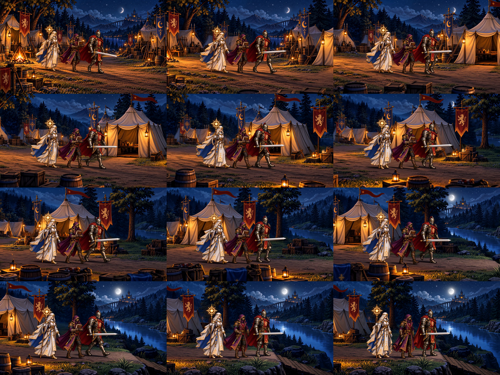
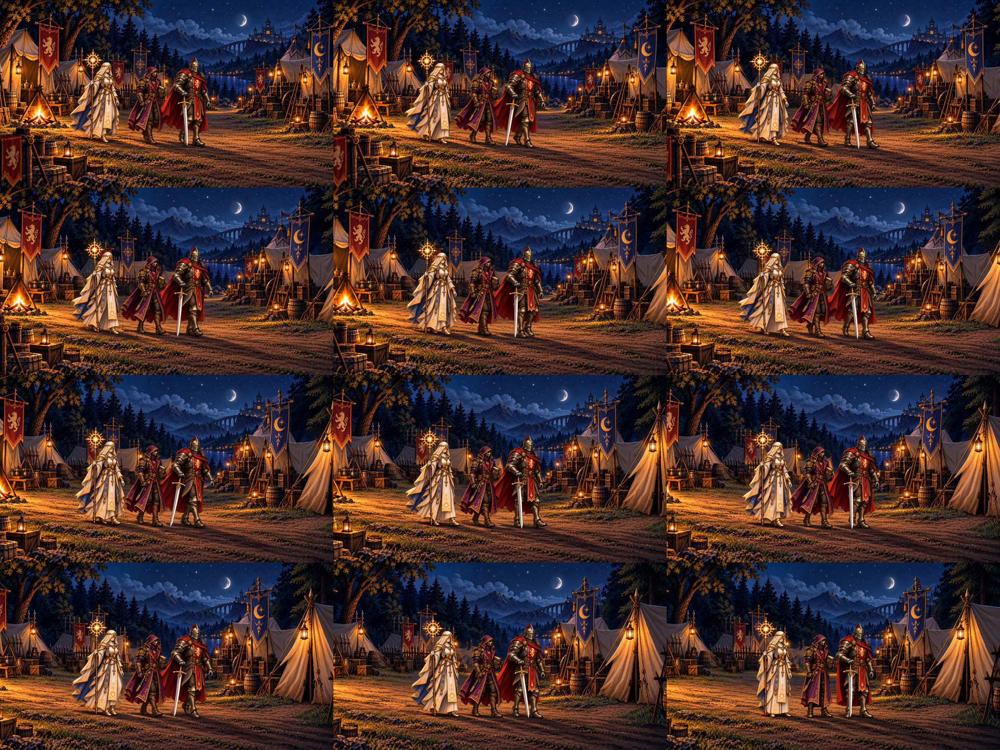
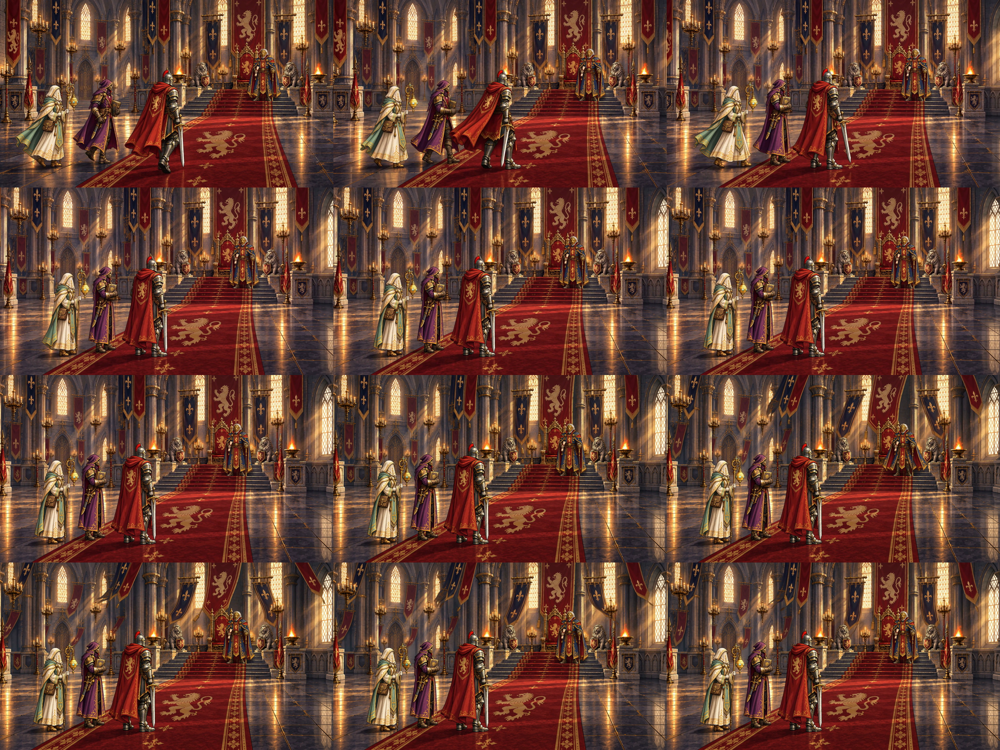
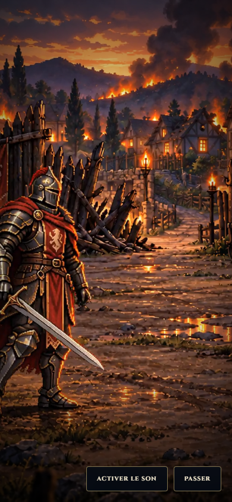

# Cinematic active-motion candidate checkpoint

2026-10-02 UTC, item 8 **IN_PROGRESS**. Standing MiniMax authorization was used without exposing credentials. Six real candidates were generated: three camp, two audience, and the first 10-second block of Bois-Clair arrival. **No production video was replaced.** Items 1–7 remain complete and audio DEFERRED.

## Artistic decisions

| Candidate | Decision | Actual observation |
| --- | --- | --- |
| Camp 1 | REJECTED | True walking, but disappearing book, crescent/full-moon drift and softened pixel construction |
| Camp 2 | REJECTED final art | Book/moon fixed and walking retained; actor pixel construction still unaccepted |
| Camp 3 | REJECTED active staging | Better retained equipment/detail, but insufficient sustained locomotion and camera drift despite locked-camera diagnostic |
| Audience 1 | REJECTED | Invented paper, lost Alaric equipment, book moved/redesigned and cropped final foreground |
| Audience 2 | Retained progress, final art unaccepted | Standing Alaric and held equipment/book restored; full-body source framing corrected; pixel detail/court cadence need further acceptance |
| Bois-Clair arrival shot 1 | PASS limited block review, full slot pending | Real arrival steps followed by attention/stop, active fire/smoke, recognizable promoted street and V2 equipment; no rescue/loot outcome |

Camp has consumed its three autonomous attempts. Do not reset numbering or submit a fourth with the current pipeline. No provider request remains pending. These records are deliberate review decisions, not automatic acceptance or a claim that item 8 is complete.

Bois-Clair is only the first half of the approved 20-second slot. Shot 2 still needs an integrated keyframe, generated motion and deliberate-cut continuity. Its 390×844 preview keeps the concealed head, sword and controls visible, but partially crops left armor/cape. **Mobile artistic framing is still pending**, despite technical skip passing. The two black cells in its ten-sample contact sheet are padding; the independently decoded final frame is nonblank.

## Evidence and technical scope

The [first checkpoint proof](cinematic-active-motion-1/candidate-qa.json), [followup proof](cinematic-active-motion-1/candidate-qa-followup.json) and [final review](cinematic-active-motion-1/candidate-qa-final.json) preserve exact submitted specs/prompts, provider task IDs, source/output hashes, sampled decoded frames, diagnostic frame deltas, mastering and real-player results. Earlier proof was not overwritten. Ordinary raw clips, masters and frame galleries remain in ignored `tmp/cinematics/`; their paths/hashes are durable in the tracked records. Keyframes and provenance are tracked outside public/runtime.

- **115/115** final focused tests: task continuation, CIN-4 specs/media and eight-slot census. TypeScript, contract validator and production build pass; exactly eight MP4s ship.
- **55/55** isolated real-player cases across the five full-length camp/audience candidates: natural completion, passive hold/release, keyboard skip at 1920×1080, 1366×768, 620×780 and 390×844, reduced motion, failed-load fallback, canvas cleanup and unchanged isolated saves.
- **4/4** skip previews for the partial Bois-Clair block at the same four sizes. This does not test completed 20-second playback, deliberate-cut continuity, campaign choice/resume or replacement acceptance.
- Six raw streams are 2560×1440/24fps H.264 with provider AAC. The existing mastering pipeline strips audio and normalizes to silent 1920×1080/24fps, 12 seconds for camp/audience and 10 seconds for this Bois block. Sources exceed target duration, so no duplicated tail frames were needed.
- [Eight production MP4 and eight distinct protected reference hashes](cinematic-active-motion-1/protected-hashes.json) pass. No diff exists in `src`, `public`, the constitution or LOCKED contracts against run-start `3b4aa13`.
- Separate extended historical test run: 112/113; the CIN-6E-A fixed-baseline allowlist omits `NarrativeTableau.test.ts`, already changed by approved item-3 commit `e898e61`. It remains an inherited failure, not concealed by the final focused selection. The Vite bundle-size advisory is unchanged.

The reusable decoder tool supports the actual authored block duration; frame deltas alone cannot prove actor motion because camera movement can produce them. Manual image/sequence review is recorded above. The adapter resumes accepted tasks with `--resume true`, checks exact source/prompt/output identity before authentication and avoids duplicate create requests. Distinct master output paths preserve earlier attempts.

## Compact gallery

The gallery is capped at four promoted captures. Earlier validated historical galleries remain untouched.

## Compliance and next action

Contract set v1; read GAME_CONSTITUTION, README/manifest, all eight LOCKED contracts, operator decision, conversion matrix and the design-source audit. No LOCKED rule changed.

| Area | Status at this checkpoint |
| --- | --- |
| GAME_CONSTITUTION | PASS: presentation never changes authored truth |
| ART_DIRECTION / CHARACTERS / ENVIRONMENTS | PASS protected-byte preservation and candidate authoring; BLOCKED final replacement acceptance |
| NARRATIVE / CAMPAIGN | PASS: eight IDs, existing choices/outcomes retained; no new event adopted |
| NARRATIVE_PRESENTATION | PASS: only candidate integrated cast; later interactive agency remains tableau-owned |
| TRAVERSAL / COMBAT / SAVE | PASS unchanged: no gameplay, schema or durable-ID edit |
| UI / ACCESSIBILITY | PASS technical controls/reduced motion; BLOCKED complete new-media portrait framing acceptance |
| QA_EVIDENCE | PASS: named viewports, machine proof, four captures, explicit limits/inherited failure |
| REPOSITORY_GOVERNANCE | PASS: exclusive lock, dev checkpoints, no main or historical evidence rewrite |

Resume item 8 at Bois-Clair arrival shot 2 from its current spec (promoted burning tableau plus V2 villageoise/Marian/serpent raider). Preserve the accepted limited shot-1 findings and its 10-second master; do not present it as the complete slot. Resolve portrait framing and shot-to-shot identity/geography before full-slot acceptance. Keep camp's three reviewed attempts closed under the existing cap; retain audience 2 as progress while preparing a concrete source/style/cadence correction before another attempt. Five other slot families still need keyframes/motion. Any production replacement requires separate final artistic and campaign/runtime acceptance.
