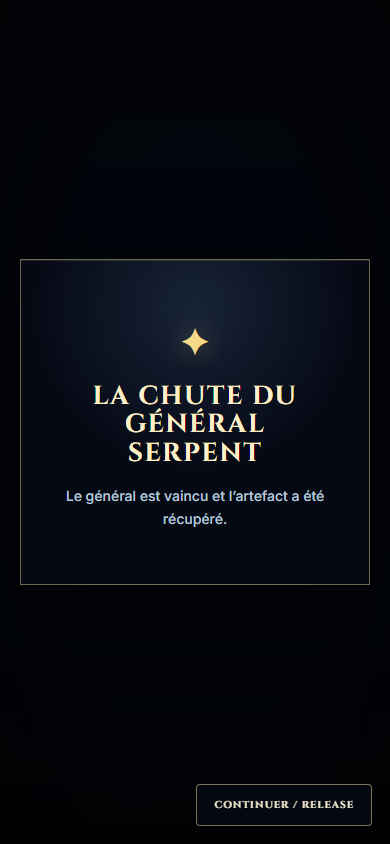

# Eight-slot remaster preparation and existing-media QA

2026-10-02 UTC. Acceptance: **preparation and existing-media integration only**. No replacement video accepted/shipped. See [remaster state and compliance](../autonomy/CINEMATIC_EIGHT_SLOT_REMASTER.md), [slot brief](../../tools/cinematics/specs/production_eight_slot_remaster_brief.json) and [machine proof](cinematic-eight-slot-remaster-preparation-1-browser/browser-qa.json).

All eight sources decode as silent 1920×1080 H.264, 24 fps. Twenty-four exact first/middle/final frames were inspected; timings/hashes are preserved in the proof. Old identities/lighting do not establish new authority. Eight specs / 14 blocks are prepared; the camp has one tracked raster candidate. Replacement motion awaits external-provider authorization.

| QA scope | Accepted | Limits |
| --- | --- | --- |
| Isolated real player/decoder | 88/88 | Four viewports; natural, skip, reduced, hold, failure; current media |
| Built production 1366×768 | 8/8 | All eight clip IDs; dialogue, choice, handoff and resume |
| Built production 390×844 reduced | 8/8 | 14 choice groups within viewport; focused native buttons activated by keyboard |
| Built production 390×844 unavailable media | 8/8 | Bounded recovery preserves choices, handoffs and V6 truth |
| Final neutral Serpent caption | 1/1 player + 2/2 campaign | Rendered corrected text; disclosed/concealed endings after rebuild |
| Unit/static/build | 127/127 + PASS | Seven suites; TypeScript; contracts; Vite; exact eight shipped MP4s |
| Protected hashes | 27/27 | Existing MP4s, environment/V2 refs and camp candidate |

Promoted JSON combines 80 initially passing player cases with eight corrected failure-case reruns; source paths and corrections are retained. Aborted requests can return valid bounded timeout rather than error. Concealed-ending ID and iframe-boot fixture mistakes were also corrected before final production acceptance. Checks use real GameApp/save/renderer and an explicit combat-result fixture; tactical balance, full Tab navigation and full-demo QA are not claimed.

Only the Serpent descriptor fallback text changed to a branch-neutral fact. All MP4 bytes, durable IDs, game truth, canonical references and LOCKED contracts remain unchanged. Audience capture records a transition, not settled dialogue readability; hold capture is the isolated player lab, not interactive campaign dialogue.

Four inspected captures/measurements promoted explicitly into this new report directory. Ordinary outputs stay ignored under tmp/cinematics/eight-slot-remaster; no historical report overwritten.
