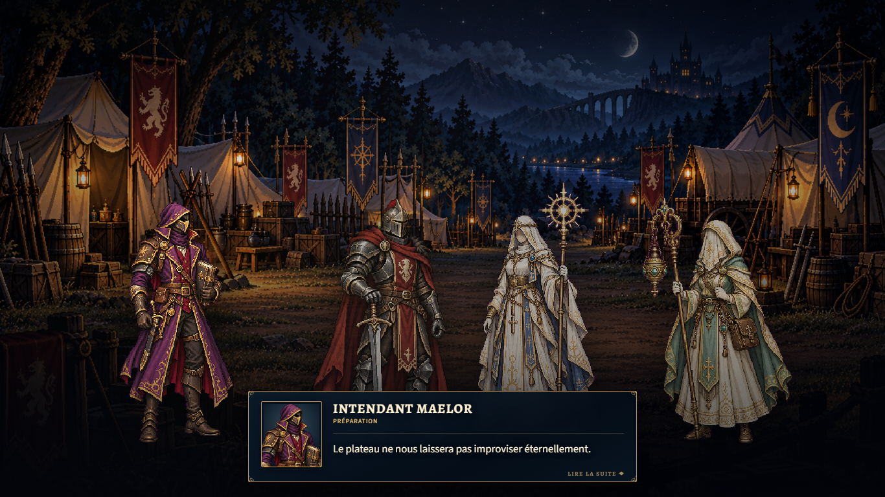
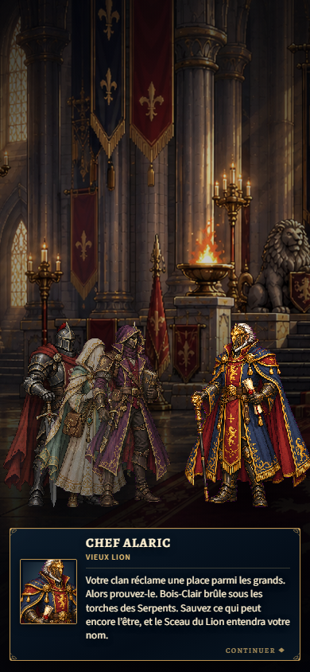
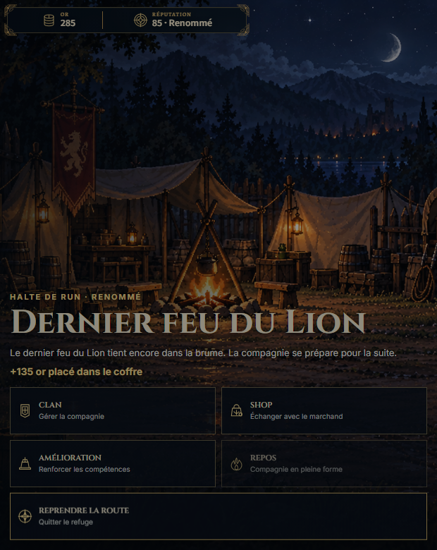
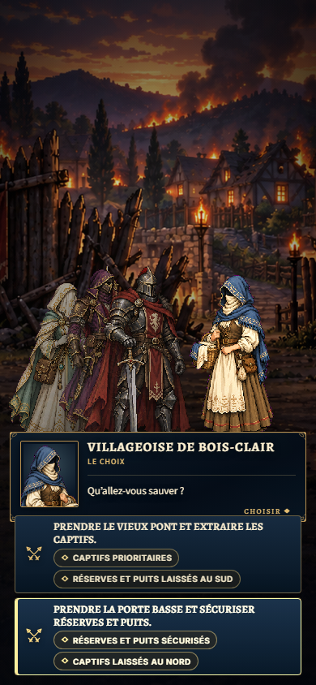
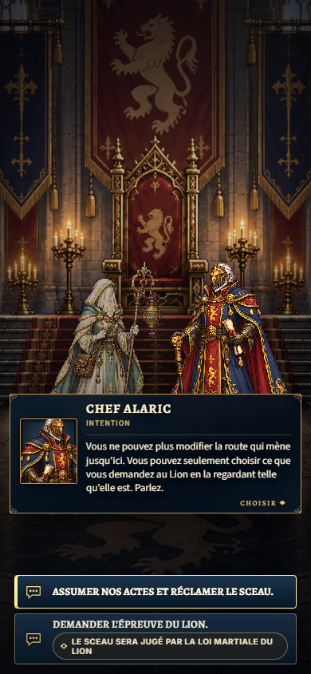
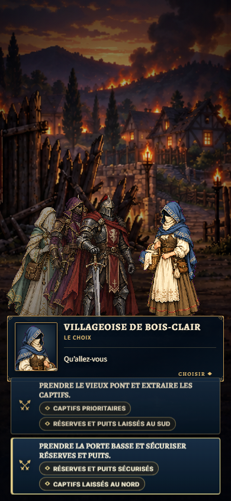

# Existing-media cinematic structure acceptance

| Field | Value |
| --- | --- |
| TASK | CINEMATIC-STRUCTURE-READINESS |
| DOMAIN | Presentation, UI/accessibility, campaign lifecycle QA |
| BASELINE | dev @ ca434f4f8d730a222c0622e8bef135b011b39286, with interrupted reduced-motion WIP preserved |
| BRANCH | dev |
| HEAD | 50c2489a2f09a606f9439a1970b55044ee175024 |
| STATUS | REVIEW; existing-media structure accepted, full demo acceptance separate |
| MERGED_IN | NONE; direct authorized dev checkpoint |
| SUPERSEDES | NONE; prior reports retained as dated evidence |
| SUPERSEDED_BY | NONE |
| PRODUCTION_IMPACT | OS reduced motion is honored with normal game graphics; cinematic fallback, static travel art and immediate dialogue reveal share one preference resolver |
| CANONICAL_DOCS_UPDATED | docs/autonomy/CINEMATIC_STRUCTURE_READINESS.md; CINEMATIC_EXTENSION_PLANNING.md; docs/project/CURRENT_STATUS.md; autonomy state pair |
| EVIDENCE | [Machine proof](cinematic-structure-readiness-1-browser/browser-qa.json), six explicitly selected captures; ordinary runs retained under tmp/cinematics/structure-readiness-20261002 |

CURRENT FACT, 2026-10-02 UTC. The previous run's uncommitted correction was preserved from Devin's handoff and temporary-index snapshots, then verified and pushed. Normal graphics passed `reducedMotion:false`, which previously suppressed the OS preference through nullish coalescing. The shared resolver now ORs the two requests in player, stage, travel still and dialogue reveal. No game truth, save schema/ID, canon or MP4 changed.

| Current built-production check | Result | Scope |
| --- | --- | --- |
| OS reduce, game reducedGraphics=false, 1366×768 | 8/8 PASS | All eight approved IDs observed, fallback/choices/resolved-node resume |
| OS reduce, game reducedGraphics=false, 620×780 | 8/8 PASS | Same, actual choice bounds and keyboard Enter |
| OS reduce, game reducedGraphics=false, 390×844 | 8/8 PASS | Same, twelve choice groups |
| Normal desktop | 8/8 PASS | Every approved video observed with retained campaign agency/resume |
| Mobile unavailable MP4s | 8/8 PASS | Bounded recovery, choices/outcomes and resolved V6 resume |
| Mobile game/OS reduced | 8/8 PASS | Existing game-setting reduction remains usable |
| Full-run OS coverage assertion rerun | 8/8 PASS | Eight unique approved IDs, sixteen approved player calls |
| Targeted mobile prelude interruption | 2/2 PASS | Actual decoded Bois-Clair/judgement video interrupted by reload; complete V6 save unchanged before resumed choice |
| Targeted mobile OS choice captures | 2/2 PASS | Focused native choice controls captured and inspected |

Total **60/60 scenarios** in nine runs; zero unexpected browser console, page or request errors. Full OS runs each record twelve keyboard-activated choice groups, one primary interactive tableau, 1–4 visible actors and zero dialogue/choices on a video hold. Resolved-node reload preserves canonical truth and mounts no media/combat replay. The source-aware coverage assertion refuses a full OS run missing any of the eight slots.

Focused unit checks: **166/166 across fourteen suites**. TypeScript, eight-contract validator, production build and eight shipped MP4s PASS. Staging validator: 75 dialogues, 257 dialogue steps and 282 runtime steps covered; no choice purity, text capacity or ownership violations. Two dead/unreachable historical steps are reported separately by that validator. All eight production MP4 SHA256 values match the retained inventory.

The [canonical readiness map and PASS matrix](../autonomy/CINEMATIC_STRUCTURE_READINESS.md) covers GAME_CONSTITUTION, art/characters/environments, narrative/campaign/presentation, preserved Traversal/combat/save, UI/accessibility, QA evidence and repository governance. Protected-path Git gates are unchanged. [Prologue/refuge planning](../autonomy/CINEMATIC_EXTENSION_PLANNING.md) introduces no extra active slot; Alistair remains undecided, artistic remaster incomplete/external, audio DEFERRED.

Limits: node-seeded V6 cases and explicit real-combat result fixtures establish lifecycle, not tactical balance or a continuous whole-campaign release pass. Focus/Enter choice proof does not certify full Tab navigation. Two targeted video interruptions do not certify every possible mid-video/outcome interruption. Those acceptance gaps continue in item 9. Current media is not newly remastered or artistically accepted.

