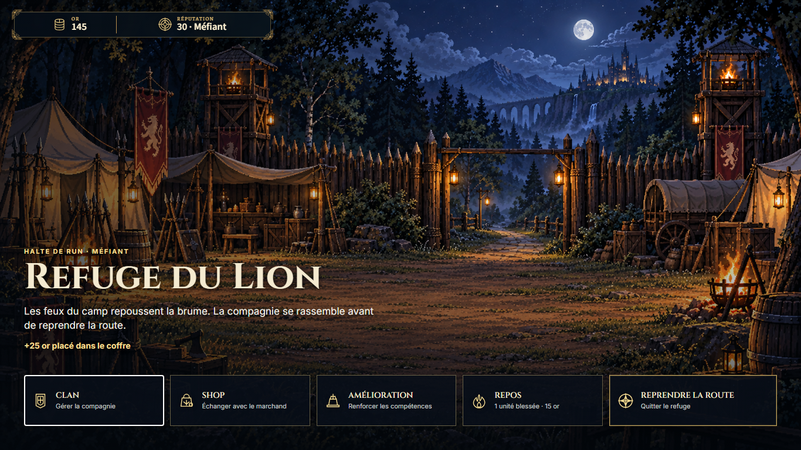
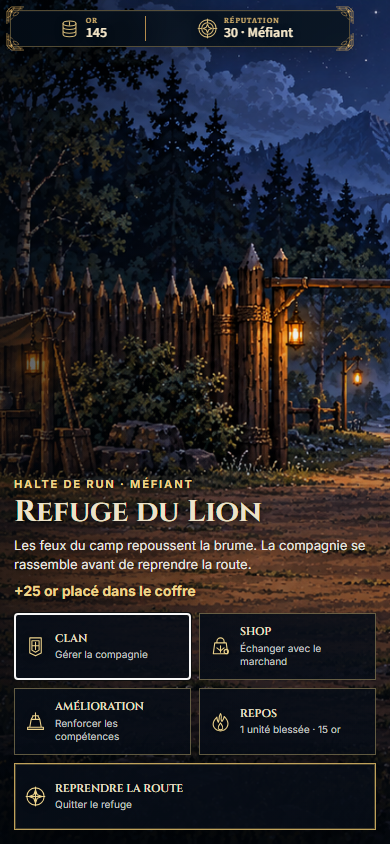
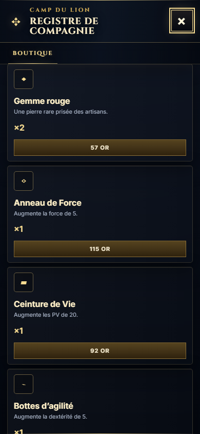
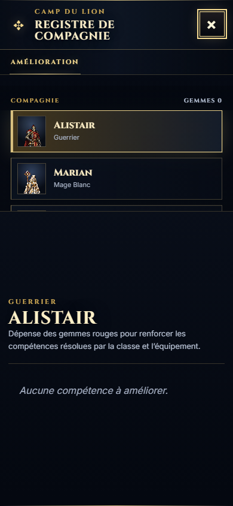
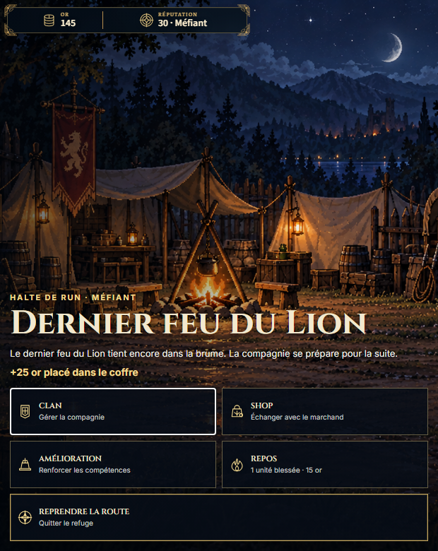
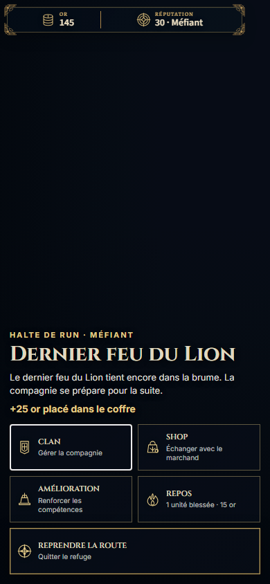

# Refuge and management keyboard focus checkpoint

| Field | Value |
| --- | --- |
| TASK | DEMO-QA-POLISH / REFUGE-KEYBOARD-FOCUS-1 |
| DOMAIN | UI/accessibility, refuge lifecycle QA |
| BASELINE | dev @ 50c2489a2f09a606f9439a1970b55044ee175024 |
| BRANCH | dev |
| HEAD | 7c4cd12b67145779803f8dff30ab72c93e0c228c |
| STATUS | REVIEW; scoped focus fix accepted, item 9 remains IN_PROGRESS |
| MERGED_IN | NONE; direct authorized dev checkpoint |
| SUPERSEDES | NONE |
| SUPERSEDED_BY | NONE |
| PRODUCTION_IMPACT | Focus enters ready refuges, returns to the prior enabled action, survives management rebuilds, stays in the active named modal and releases on close |
| CANONICAL_DOCS_UPDATED | docs/project/CURRENT_STATUS.md; autonomy state pair |
| EVIDENCE | [Machine proof](refuge-keyboard-focus-1-browser/browser-qa.json), six selected inspected captures; ordinary output under tmp/refuge/production-accessibility-20261002-* |

CURRENT FACT, 2026-10-02 UTC. A strengthened built-production assertion reproduced `Refuge entry loses focus to BODY`. The older twelve-case boundary run passed service mechanics but did not assert focus ownership. This was an inherited focus defect, separate from the cinematic reduced-motion correction.

ExplorationView now focuses an enabled native action after image readiness, including failed-image fallback. Within the same refuge it remembers the previous action; another refuge starts at Clan, and an unavailable Rest action falls back to an enabled action. Rest feedback is a status region. This state remains ephemeral and is never serialized.

ManagementView names its existing dialog, inerts its current root siblings and restores their prior state on close. It assigns entry focus, retains the corresponding control after rerender, confines Tab to the active dialog, and makes Escape close equipment/item details before management. Equipment detail close returns to its slot; management close restores a connected opener or allows the rebuilt refuge to own focus. Existing resource/equipment/service mutations remain in their original owners.

| Built-production acceptance | Result |
| --- | --- |
| First and second refuge × 1366×768, 620×780, 390×844 × normal and OS-only reduced motion | 12/12 PASS |
| Failed first-refuge background, mobile normal motion | 1/1 PASS |
| Failed second-refuge background, mobile OS-only reduction | 1/1 PASS |
| Supplemental mobile management captures after finite animations settle | 1/1 PASS |

**15/15 final cases** verify keyboard Tab/Shift+Tab and Enter/Escape, owned visible focus, named management modal, inventory tab and equipment-detail rebuilds, permanent-wallet potion purchase through `buyItem`, unchanged temporary loot, authoritative Rest cost/health, disabled healthy Rest, unchanged V6 resume without duplicate loot securing, and resolved departure. Both refuges retain one HUD/hub owner, loaded or explicit dark fallback, readable labels, 44px-or-larger hub targets, and no HUD/action overlap or viewport overflow. Unexpected browser errors: zero. Aborted background requests are classified only for the two exact authored refuge plates.

Focused tests: **16/16 in five suites**; TypeScript, contracts and rebuilt production PASS. No art, canonical text, save schema/ID, Traversal, combat or locked contract changes. The driver exposes the real built GameApp for observation and seeds an isolated canonical V6 node path; it does not bypass refuge dialogue/services or mutate live truth after boot. Purchase expectations are computed separately by the existing owner rule.

Scope limits and next work: Skills is opened/closed, not upgraded. Sale, crafting, equipment preview/confirm and a continuous whole-campaign run are not accepted here. Inventory detail rows remain clickable non-keyboard divs; price-only trade and cost-only upgrade names need contextual labels. Equipment preview Retour currently returns to the modal close control rather than its preview item. These inherited accessibility gaps remain item 9; this checkpoint does not mark the full demo or all ManagementView accessibility complete.

## Contract compliance of the bounded checkpoint

Set v1 / PRODUCTION-CONTRACTS-LOCK-1. Constitution, contract README/manifest and all eight contracts read across the run/reviewers. Relevant rules: single focus/lifecycle owner, accessible responsive controls, presentation/truth separation, durable saves, evidence and repository governance. No LOCKED rule changed; baseline-to-HEAD protected-path diff and protected-path status are silent.

| Area | Verdict | Evidence |
| --- | --- | --- |
| GAME_CONSTITUTION | PASS | Existing game identity and authority preserved. |
| ART_DIRECTION / CHARACTERS / ENVIRONMENTS | PASS | Existing media and V2 assets retained; explicit background fallback tested. |
| NARRATIVE / CAMPAIGN / NARRATIVE_PRESENTATION | PASS | Existing gathering, service and departure sequence preserved. |
| TRAVERSAL / COMBAT | PASS | No implementation or resolution changes. |
| SAVE | PASS | UI focus remains transient; V6 securing/rest/purchase resume checks pass. |
| UI / ACCESSIBILITY | PASS for delivered focus boundary | Three viewport/native-keyboard checks; broader inherited debt remains explicit. |
| QA_EVIDENCE | PASS | Reproduced before-failure, final production machine proof and inspected settled captures. |
| REPOSITORY_GOVERNANCE | PASS | Single lock holder, WIP backups and dev-only verified checkpoints; protected documents unchanged. |

