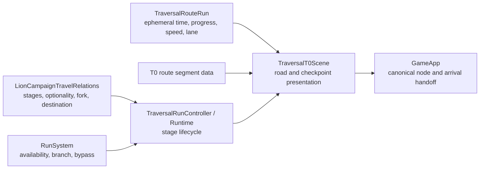

# TRAVERSAL-T0-ROUTE-CHECKPOINTS-1 — Lot A

## Baseline and boundary

Base `main`: `0c47f3a154f4bbea4b69a8012052a287d2a09b42`, the merge of the approved
`traversal-remaining-legs-audit-1`. The previous T0 scene drove one 9,000-unit road continuously.
Its stage beats sat at fixed progress points and shared that road with a roadside merchant,
random local wolf combat, decorative pickups, and other local road furniture. The relation and
RunSystem already owned the canonical stage order, fork, optional bypass, and destination.

Lot A changes T0 physical presentation only. The production gate still enables T0 alone. No
RunGraph, campaign node, reward rule, combat rule, save schema, durable route state, T1–T4, or
final-refuge behavior changed.

## Vocabulary and flow

| Term | Meaning in this branch |
|---|---|
| Route segment | Active two-lane side-on road with an automatic speed crescendo. |
| Checkpoint | Short authored world approach to an existing canonical interrupt. |
| Fast checkpoint | The existing Traversal fork overlay after a short junction approach. |
| Arrival | Physical Route 6 completion, then the existing covered Journey destination handoff. |

Old: departure → continuous road with local beats and stage stops → fork on the same road →
branch encounter → physical arrival.

New: departure → Route 1 → opening ambush → Route 2 → Cedric → Route 3 → Refugees
(Aider/Passer) → Route 4 → fast fork → Route 5A/5B → selected canonical branch consequence →
Route 6 → arrival → explicit Journey destination agency → `lion-first-refuge` only after the
player chooses it.

## Authority

The scene calls `TraversalRunController` for checkpoint activation, node handoff, fork selection,
and resume. The controller calls the existing fork overlay. Its branch callback invokes
`selectTraversalBranch` exactly once; the selected RunSystem value chooses Route 5 and the
existing world variant. Refugees Passer releases the presentation decision, then asks GameApp's
existing optional bypass callback to apply RunSystem and reputation policy. Presentation does
not resolve any node. `GameApp` remains the only canonical node and arrival handoff owner.

## Route runner, configuration, and renderer

`TraversalRouteRun.ts` is pure: supplied delta milliseconds advance an immutable ephemeral
state. It validates duration/speed data, clamps at one completion, and uses a smoothstep speed
curve from `vMin` to `vMax`. Lane changes do not alter time or speed. `resetRouteSpeed` is a
tested narrow Lot B seam and has no Lot A gameplay caller. No DOM, GameApp, clock, save, or
campaign object enters the runner.

`TraversalT0CheckpointRoute.ts` authors six T0 segments as data. The durations are tuning values,
not canonical contracts: 12 + 15 + 15 + 12 + 15 + 20 = **89 seconds** of configured active
driving. Route 5 requires the branch ID already stored by RunSystem and chooses Route 5A or 5B.
The canonical checkpoints still come from the relation and available RunNodes. T1/T3/T4 are not
generalized or enabled here.

`TraversalRouteRenderer.ts` layers the verified existing
`road/t0-wide-road-loop.png` and `background/t0-far-panorama-loop.png` assets, with slower far
motion. The same caravan, two lane controls, campaign status HUD, and T0 side-on world language
continue. The checkpoint view reuses `TraversalWorldRenderer` and the authored opening ambush,
nomad waystation, resting clearing, forest junction, and branch world sections. A covered focus
switch leads to a 1.15-second physical checkpoint approach, then the canonical interaction.
After resolution the existing covered return resumes the next route. Route 6 has no pursuer or
extra checkpoint.

## Removed and deferred T0 route content

- Removed the active `t0:npc:roadside-merchant` beat from `TraversalT0Route.ts` and the active
  `merchant-halt` world section from `TraversalT0World.ts`. The `roadside_peddler` source dialogue,
  historical local narrative mapping, and merchant art remain in the repository; no refuge shop
  changed. The canonical Route 5A wounded merchant (`lion-first-trial-event`) remains.
- The active Lot A beat list now contains only canonical stages and branch consequences. Local
  wolf road combat, chest/gold/ward pickups, and obstacle presentation are absent from active
  flow. No reward, `routeGold`, `temporaryLoot`, collision penalty, chase, or risk logic was added.
- Local random road combat is deferred to `TRAVERSAL-T0-PURSUIT-1`. A later pursuer controller can
  sample route progress/speed during the route tick and request a separate encounter handoff;
  it must leave checkpoint authority with the relation, controller, RunSystem, and GameApp.
- Lot B can add route collectibles or obstacles to the active route renderer and call the pure
  `resetRouteSpeed` seam after an approved collision rule. Lot A calls none of those hooks.

## Save and arrival contract

Route index, elapsed time, progress, speed, and lane remain in scene memory. Existing safe save
boundaries apply: a reload during Traversal restarts from the saved origin, while arrival saves
and resumes the canonical campaign. Route 6 ends in `ARRIVING`; the existing covered GameApp
handoff releases Traversal and presents the Journey destination choice. There is no implicit
`lion-first-refuge` commit and no TravelView success flash.

## Test and browser evidence

The DEV-only entry `?qa=1&traversal=t0` drives the real T0 relation and RunSystem. The browser
driver in `tools/traversal-t0-route-checkpoints-1-browser.mjs` uses real time and UI clicks,
using only the pre-existing combat QA victory control. Its screenshots, gallery, motion flow,
and responsive measurements are under `docs/reports/traversal-t0-route-checkpoints-1-browser/`.
The run covers both fork paths and Refugees Aider/Passer. Automated screenshots and telemetry
support inspection; artistic acceptance remains with the operator's runtime review.

### Measured runtime and validation

The browser driver sampled the real `requestAnimationFrame` route at roughly 100 ms intervals.
The table reports active driving only; dialogue, combat, checkpoint approaches, and covers are
separate. Speeds are route motion multipliers at 10%, 50%, and 90% progress, rounded to 0.01.

| Route | Configured | Branch A observed | A speed 10 / 50 / 90% | Branch B observed | B speed 10 / 50 / 90% |
|---|---:|---:|---|---:|---|
| 1 | 12 s | 12.02 s | 1.04 / 1.64 / 2.22 | 12.01 s | 1.04 / 1.63 / 2.22 |
| 2 | 15 s | 14.89 s | 1.04 / 1.69 / 2.32 | 15.07 s | 1.04 / 1.69 / 2.32 |
| 3 | 15 s | 14.95 s | 1.04 / 1.68 / 2.31 | 14.93 s | 1.04 / 1.68 / 2.32 |
| 4 | 12 s | 11.99 s | 1.09 / 1.76 / 2.41 | 12.00 s | 1.09 / 1.76 / 2.41 |
| 5A / 5B | 15 s | 15.06 s | 1.09 / 1.78 / 2.46 | 14.98 s | 1.09 / 1.78 / 2.46 |
| 6 | 20 s | 19.96 s | 1.25 / 1.96 / 2.66 | 19.92 s | 1.24 / 1.95 / 2.66 |

Across both runs, the five route-completion-to-checkpoint-ready intervals were 1.94–2.08 s;
that includes the covered focus and 1.15 s physical braking approach, but excludes checkpoint
content. Checkpoint-completion-to-next-route-visible intervals were 0.33–0.44 s. Individual
sampled covers took 0.78–0.91 s for focus, 0.82–1.01 s for event handoff, and 0.76 s for the
fork; entry was 0.33 s. These figures have about one sampling interval of measurement
uncertainty. The fork's longer real pause is the operator's choice time, not a forced cover.

Both real browser flows completed with exactly five checkpoint entries and five exits, no
backward route progress or progression errors, one active Traversal scene at most, and one
arrival callback. Branch A selected `lion-first-trial-event` and Aider at Refugees. Branch B
selected `lion-first-trial-combat` and Passer; the optional bypass continued via the existing
GameApp/RunSystem consequence callback. Both reached Route 6 and explicit Journey destination
agency. The captured agency state has no TravelView success flash or early `lion-first-refuge`
commit. CP1 and CP5B screenshots show actual combat deployment; the driver uses only the
existing DEV combat QA victory control to return.

The gallery has 36 screenshots: all 19 named desktop states at 1440×810 plus 16 captures at
620×780 and 390×844 for moving route, checkpoint, Refugees, fork, Route 5, and arrival states.
The additional desktop frame captures the branch B Refugees Passer choice. Browser QA found
zero page errors, zero horizontal overflow, and zero unreachable lane controls. Both mobile
lane buttons were visible and measured at 44×44 px. The gallery and short WebM support human
motion review; measurements do not establish artistic acceptance.

Validation: focused Traversal/campaign guards passed (17 files, 98 tests); full Vitest passed
(161 files, 2,559 tests); `tsc --noEmit`, production Vite build, and `git diff --check` passed.
Vite emitted a large-chunk advisory. No cinematic baseline, wildcard, or
allowlist was changed.

## Known limits

The loop art repeats and Route 6's climax comes from speed and motion alone. Lot A deliberately
has no pursuer, elite, route combat, collision, collectible, or economy beat. The speed curve,
checkpoint rhythm, and overall enjoyment still need operator motion and visual approval before
Lot B or C starts.
