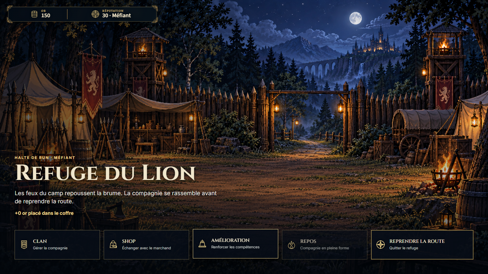
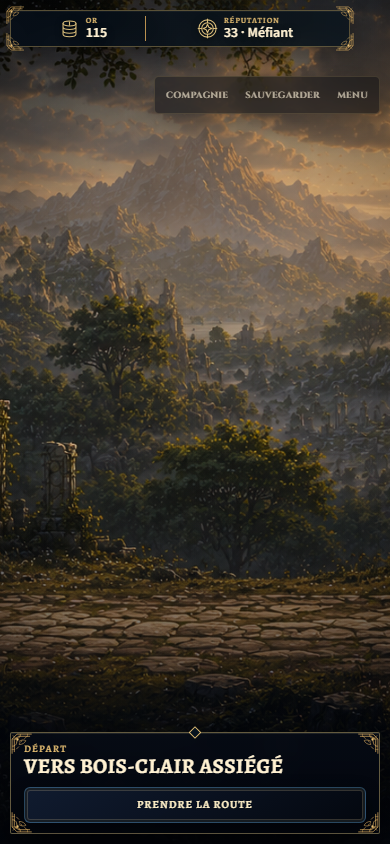
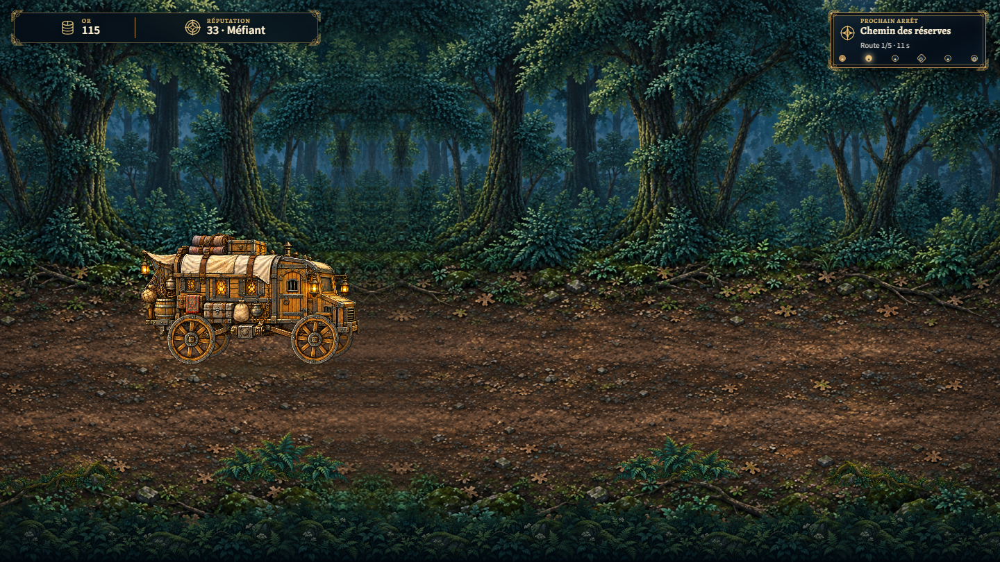
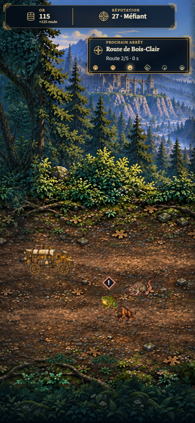
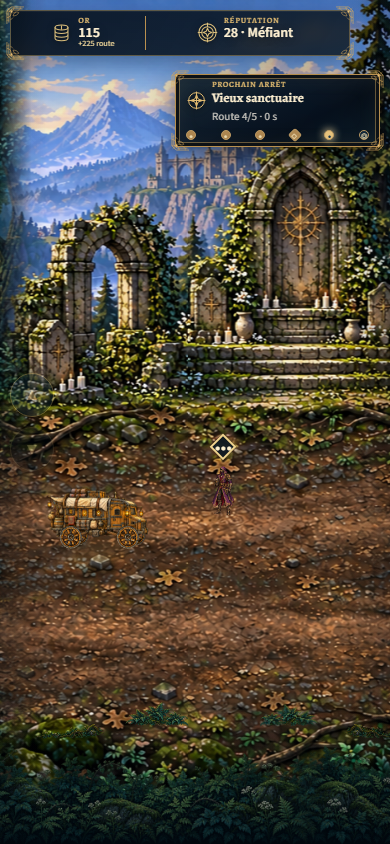
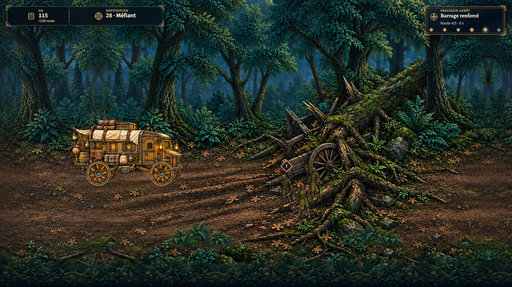
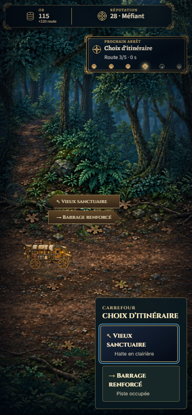
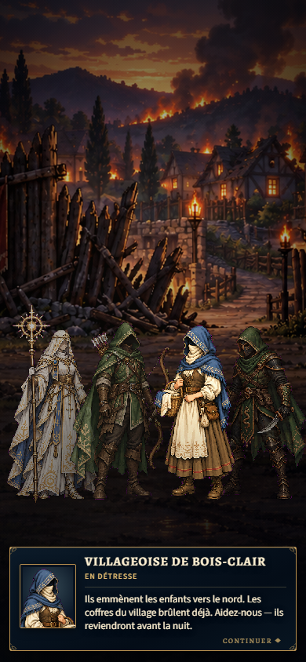

# T1 production acceptance

2026-10-01, dev. T1 is registered and intentionally enabled alongside T0. The canonical first refuge, reserve trail, Valmir road, strict shrine/combat fork and Bois-Clair boundary retain GameApp/RunSystem authority. No locked contract, dialogue, choice, durable ID or save schema changed.

228 focused tests across 34 files pass (one new test HUD fixture was corrected and all 13 orchestration tests rerun). TypeScript, eight-contract/eight-video-slot validator and production build pass. The real built-production browser passes three complete paths at 1440×810, 620×780 and 390×844, with 59 captures and zero asset/console/frame/control/handoff failures. The [machine report](traversal-t1-production-1-browser/browser-qa.json) retains measurements and eight explicitly promoted captures. All other attempts/reruns remain ignored.

The saved origin is the resolved first refuge, with its loot already secured. Reload after reserve resolution or selected fork restores that boundary and discards only unsaved leg progress, pickups and physical state. Arrival saves the canonical branch/assignment/resolved nodes and temporary loot; reloading it opens Journey agency without a new Traversal. Continuing consumes the village node through the approved bois_clair_arrival source; reduced motion reaches its canonical village_choice dialogue directly. Neither arrival nor the QA fixture resolves village choice. Keyboard arrows change lanes and Enter confirms the mobile fork. Every authored hazard/pouch and both pursuit windows resolve once on all five roads. Production pickups add exactly +5 temporary gold without changing secured gold.

Combat setup/readiness and GameApp result handoffs are real; the browser fixture posts a matching victory result from the iframe after boot. This is a campaign/Traversal acceptance test, not a tactical battle strategy or balance test.

Built-production T0 regression also passes both paths, all six roads and mechanics, 23 captures, zero reported issues. Existing T0 evidence is untouched. T3 remains unregistered and disabled.

## Selected captures

