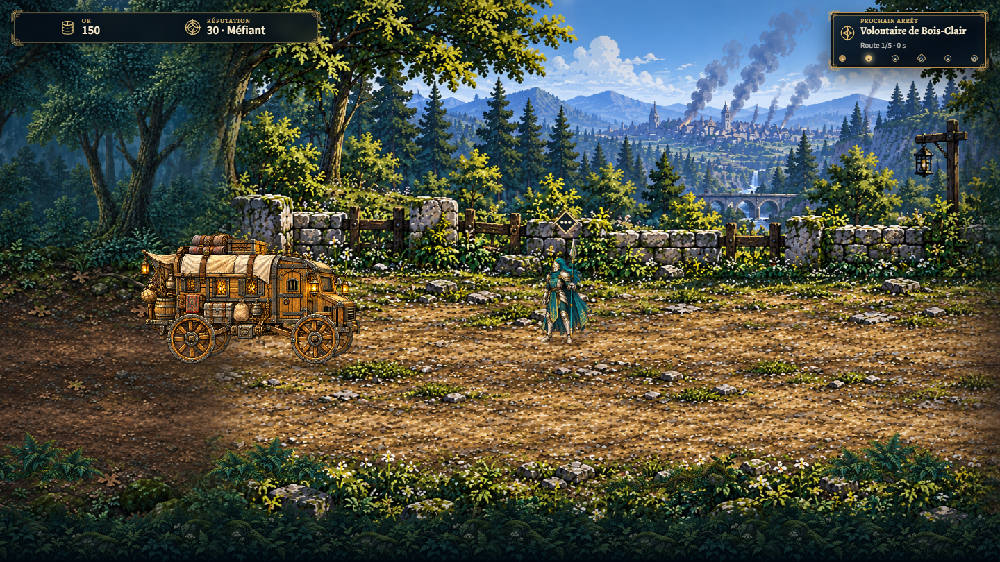
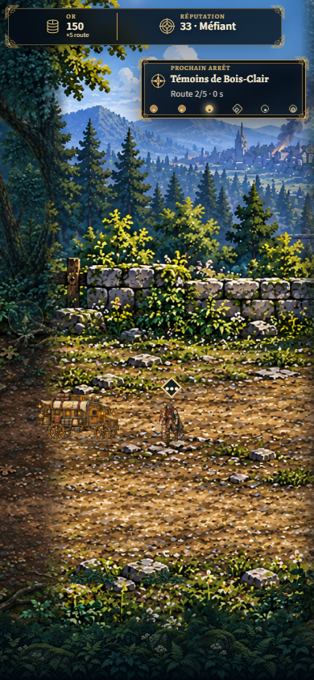
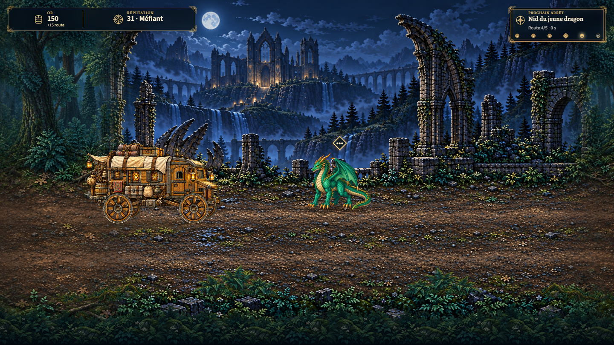
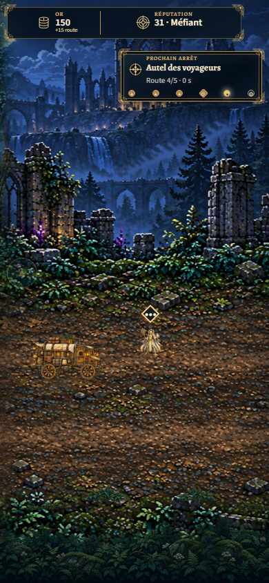
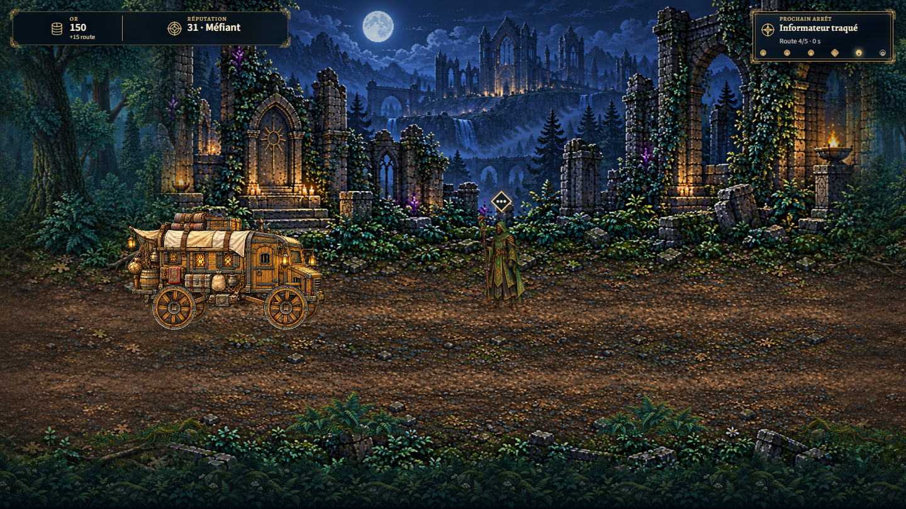
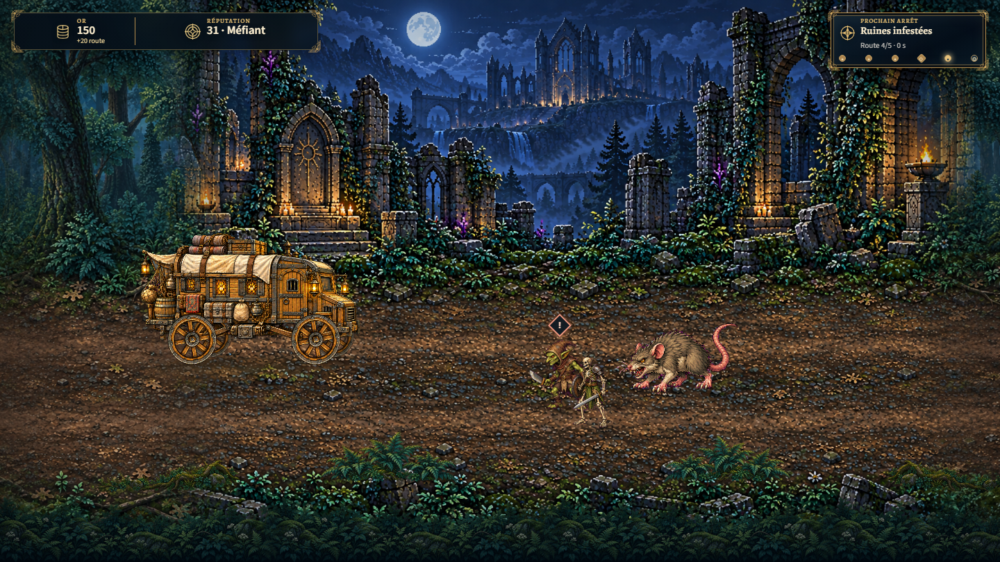
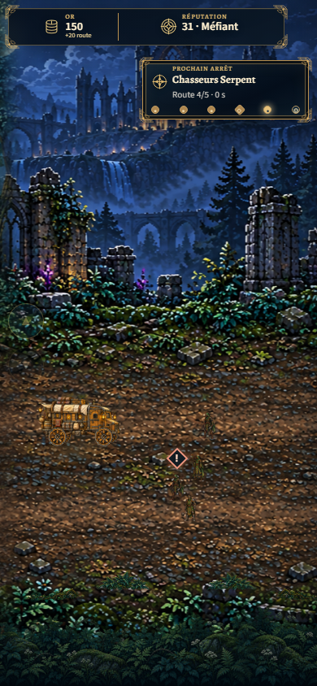
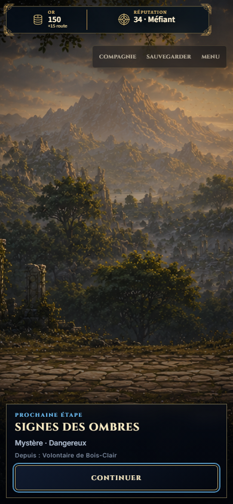

# T3 source and visual candidate checkpoint

2026-10-01. **Candidate only: T3 remains unregistered and disabled in production.** Six complete isolated DEV runs, 86 captures at 1440×810, 620×780 and 390×844; zero errors, asset/control/overflow failures or world-swap frame issues. [Machine evidence](traversal-t3-candidate-1-browser/browser-qa.json) retains all six run measurements and eight explicitly promoted captures. Full ordinary rerun: ignored `tmp/traversal/t3-candidate-qa-2/results.json`.

All four retained event assignments pass (`mystery_dragon_roost`, `mystery_shrine`, `serpent_informant`, legacy `mystery_lancer_recruit`), as do both combat formations (`ruins_guardians`, `serpent_hunters`). Each run has exactly three canonical handoffs (recruitment, witnesses, selected branch), one arrival and no visit to `lion-shadow-signs`. First-choice dialogue paths, including dragon/informant nested combat, use real GameApp resolution and the existing DEV victory fixture. Temporary-loot callbacks use RunSystem directly; the production callback correctly rejects unregistered T3. The legacy path runs fully on mobile with reduced motion. Assets and source references are hash-verified, and the protected shrine entity is unchanged.

240 focused tests, TypeScript, eight locked contracts/eight approved video slots, and production build pass. The source/art checkpoint is compliant; **item 7 is not complete**. Real second-refuge/V6 saves, other dialogue choices, nested witness combat, defeat, keyboard and built-production activation acceptance are still required. This proof does not validate battle balance or actual production save persistence. [Continuation and compliance matrix](../autonomy/TRAVERSAL_T3_PRODUCTION.md).

| Witness Road recruitment | Witness checkpoint, mobile |
| --- | --- |
|  |  |

| Dragon roost | Shrine apparition, mobile |
| --- | --- |
|  |  |

| Informant | Ruins formation |
| --- | --- |
|  |  |

| Serpent formation, mobile | Reduced-motion legacy path arrival agency |
| --- | --- |
|  |  |
