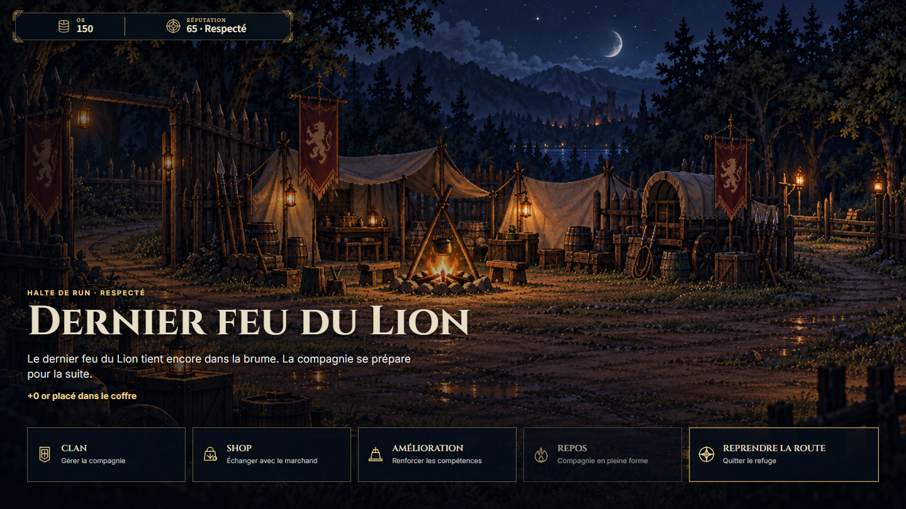
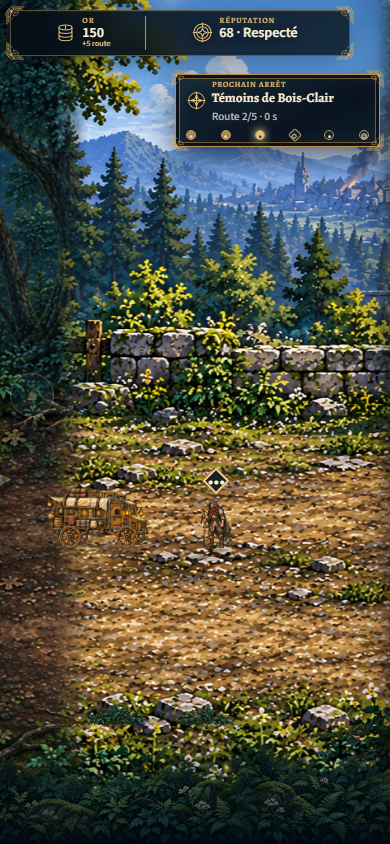
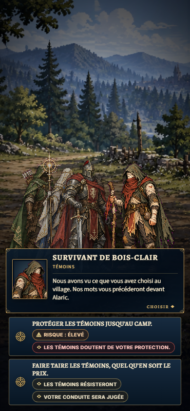
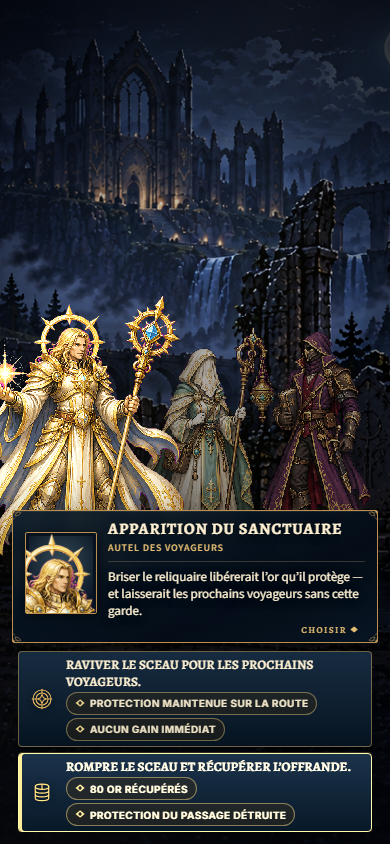
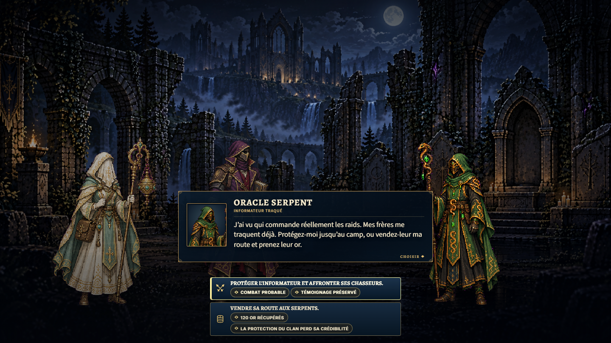
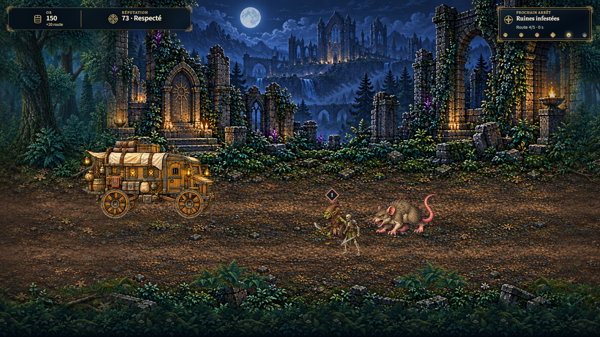
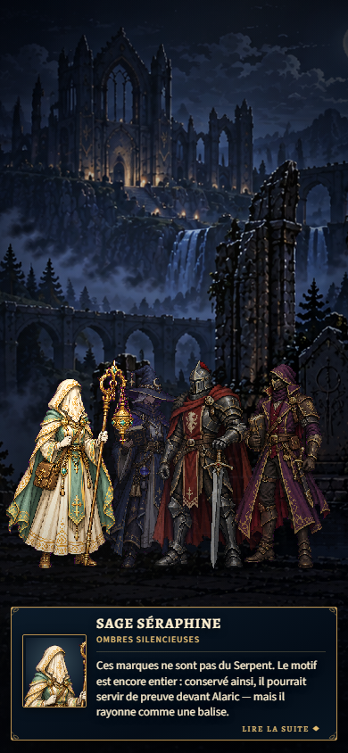
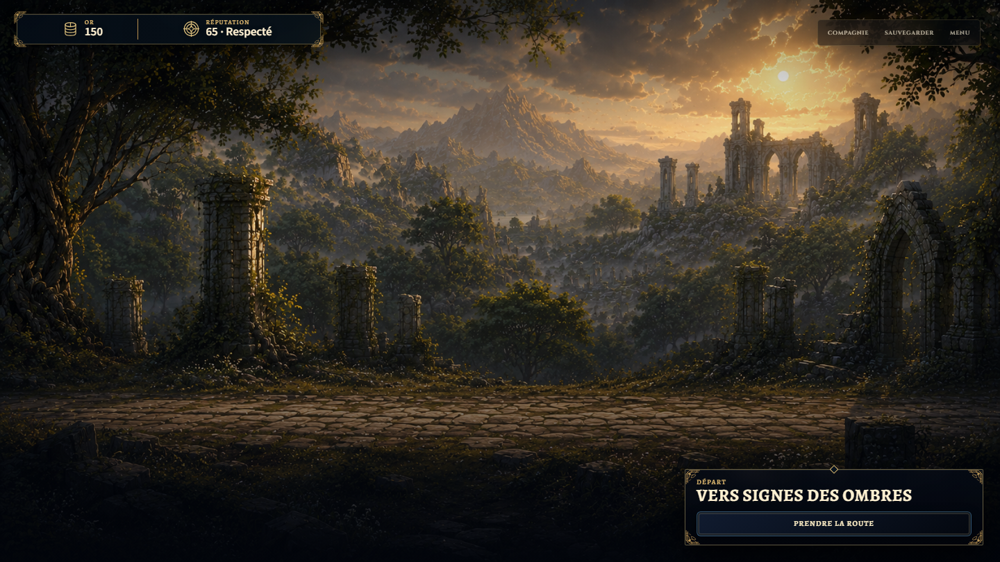

# T3 production acceptance

2026-10-02 UTC, dev. T3 is intentionally registered and enabled with T0/T1 after the complete real GameApp/V6 candidate acceptance. The canonical second refuge, recruitment, witnesses, strict adaptive fork and Shadow Signs boundary keep their existing owners. No dialogue, choice, durable ID, save schema, protected media or LOCKED rule changed.

204 focused tests across 30 files, TypeScript, eight-contract/eight-slot validation and Vite build pass. The build contains exactly eight MP4s; only the inherited chunk-size advisory remains. The DEV integration candidate passes ten scenarios/275 captures. Built production passes ten scenarios/291 captures at 1440×810, 620×780 and 390×844, with zero failures, asset/console errors or frame issues. T0 regression passes both paths/23 captures; T1 passes both branches plus mobile reduced motion/59 captures. [Machine proof](traversal-t3-production-1-browser/browser-qa.json) retains all viewport/control measurements and compact state assertions; eight captures are explicitly promoted below. Ordinary reruns and the other captures remain ignored.

A canonical V6 fixture reaches the unresolved second refuge. Its real securing/hub/departure UI establishes the origin save. Reloads after recruitment, witnesses and a selected fork restore its flags, clan, reputation, loot and unresolved road progress from the unchanged autosave. Arrival saves the final branch, existing assignment and temporary loot without visiting/resolving Shadow Signs. Destination reload opens Journey confirmation without remounting Traversal; confirming then enters the existing Shadow Signs dialogue with no video or automatic resolution.

Recruitment acceptance/refusal/failed contest, witnesses protection/refusal/silence, dragon fight/spare, shrine preserve/break, informant protect/sell, both combat formations and legacy lancer assignment pass their canonical outcome checks. Nested witness, dragon and informant victories retain the same Traversal instance in NODE_RESOLUTION, then return to the next road. Witness defeat disposes the road, restores saved facts and second-refuge checkpoint, clears transient branch/loot and presents explicit departure agency. All five road Risk/Reward/Pursuit lifecycles resolve; accepted unique pouches add exactly +5 temporary gold with secured gold unchanged. Mobile arrows and Enter fork control pass with reduced motion. Protected reference and new-image hashes remain exact.

Combat readiness and CombatBridge handoffs are real; the driver sends matching victory/defeat results from the booted iframe. This verifies campaign/Traversal lifecycle and does not claim tactical battle strategy, balance or full-campaign completion. The final compliance matrix is in [T3 production authoring](../autonomy/TRAVERSAL_T3_PRODUCTION.md).

## Selected captures

